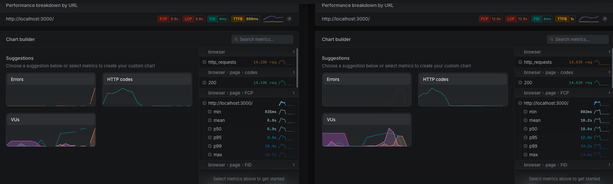

# Meteor performance

## Motivation

This repository is the base to measure performance between Meteor 2 and Meteor 3. It serves as a comparison point for various functionalities and helps catch any performance regressions.

This repository can inspire you to adapt the scripts and analyze performance in your applications. We're here to make the process easier, so feel free to share any feedback.

## What

This repository includes:

- Meteor applications for Meteor 2 and 3 to test performance, located in the `./apps` folder.
- Meteor packages for shared and isomorphic code, found in the `./packages` folder.
- Playwright tests to perform actions against the apps, found in `./tests`.
- Artillery configurations for stress testing your server, found in `./artillery`.
- Scripts to monitor performance and log results, found in `./scripts`.
- Logs from local monitoring runs, found in `./logs`.
- Benchmarks from official monitoring runs, found in `./benchmarks`.

## Requirements

- Unix System
- Node 20.x version

## How

### Running locally

To run a stress test on your machine:

```shell
npm install
./scripts/monitor.sh <app> <artillery-script> <log-context>
```

- `<app>`: The app folder name within `./apps` to stress test.
- `<artillery-script>`: The artillery configuration within `./artillery`.
- `<log-context>`: A name to prefix the logs generated within `./logs`.

The process will take some time, and the logs are updated live at `./logs`.

Your machine might struggle with the default artillery configuration, but it should still reveal performance differences between the tests. Adjust the configuration as needed by learning from [artillery.io options](https://www.artillery.io/docs).

### Visualizing Results

After running the monitoring script, you get several outputs to analyze the benchmark results:

1. **Log Files**: Plain text logs are generated in the `./logs/<log-context>-<app>-<script>.log` directory.

2. **JSON Reports**: Performance data is saved as JSON in `./reports/<log-context>-<app>-<script>.json`.

3. **HTML Reports**: Interactive visual reports are automatically generated at `./reports/<log-context>-<app>-<script>.html`. These reports include:
   - Visual graphs of response times
   - Request rates
   - HTTP codes
   - Latency distributions
   - Other Artillery metrics

   

To view the HTML report, simply open it in any web browser:

```shell
open ./reports/<log-context>-<app>-<script>.html
```

4. **Artillery Cloud Integration**: If you provide an Artillery Cloud API key as a fourth parameter, results are also sent to Artillery's cloud dashboard:

```shell
./scripts/monitor.sh <app> <artillery-script> <log-context> <artillery-key>
```

Artillery Cloud offers a free tier that allows you to compare multiple test executions side by side, making it easier to track performance changes over time or between different Meteor versions.



These visualization options make it easier to identify performance bottlenecks and compare different Meteor versions.

You can analyze performance using a Meteor checkout. This allows you to quickly measure the impact of ongoing changes and ensure consistent or improved performance.

```shell
METEOR_CHECKOUT_PATH=<path-to-meteor-checkout> ./scripts/monitor.sh <app> <artillery-script> <log-context>
```

### Running remotely

> Currently, only Meteor staff can fully manage the entire process for the tasks app.

To run a stress test on a galaxy server:

- Prepare a new application container on Galaxy
- Prepare secrets on `.env.prod` file
  - `MONGO_URL_TASKS_3_X` and `MONGO_URL_TASKS_2_X`. Url to connect to the MongoDB instance for each application.
  - `MONGO_VERSION` Version of MongoDB used to pre-clean your environment
  - `REMOTE_URL_TASKS_3_X` `REMOTE_URL_TASKS_2_X`. Public endpoint to connect to your application.

Run the following monitoring command to start benchmarking:

```shell
npm install
./scripts/monitor-remote.sh <app> <artillery-script> <log-context>
```

This will set up the remote context needed to run the playwright script.

Remote stress testing helps gather extra metrics from MontiAPM for deeper performance analysis.

For each benchmark, we recommend using a new Galaxy container to ensure a clean environment, preventing any interference with your performance results.

### Deploy

The apps are deployed to Galaxy to benefit of further analysis with MontiAPM tool.

To enable MontiAPM, use `ENABLE_APM`. MontiAPM may overload the app, so measure the metrics carefully, especially during CPU profiling. Enable or disable it in both apps for a fair comparison.

To deploy each app after changes:

```shell
./scripts/deploy.sh <app>
```

Current apps are accessible at:

- tasks-2.x: http://tasks-2.0-perf.meteorapp.com
- tasks-3.x: http://tasks-3.0-perf.meteorapp.com


## Benchmarks

### Meteor 2.16 vs 3.1.1

Meteor **3.1.1** is in average **~28% faster**, uses **~51% less CPU** and **~17% less of RAM** in a **reactive scenario**.

Meteor **3.1.1** is in average **~19% faster**, uses **~28,82% more CPU** and **~27% more of RAM** in a **non-reactive scenario**.

More details on this benchmark can be found at [`./benchmarks/meteor2.16-vs-3.1.1`](./benchmarks/meteor2.16-vs-3.1.1).

## Challenge ahead

Performance is an ongoing effort that requires continuous attention. The performance suite helps detect regressions and uncover improvements in future Meteor versions.

Performance is highly variable and depends on your use case coverage. Looking ahead, we aim to develop a more real benchmarking process. This would test additional Meteor scenarios (like having more observers, collections and subscriptions) while incorporating widely used community packages from real-world applications (publish-composite, redis-oplog, apm, etc).
